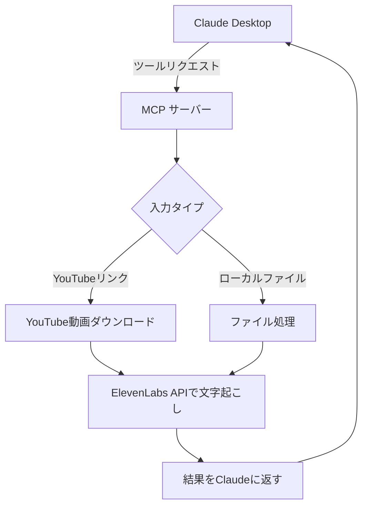

# ElevenLabs Scribe Transcriber

ElevenLabs の Scribe モデルを使用して音声ファイルや動画ファイル、YouTube の動画を文字起こしするシンプルなツールです。
MCP サーバーとして動作させることで、Claude Desktop などの MCP クライアントと連携して音声認識を行うこともできます。

[](https://www.npmjs.com/package/elevenlabs-scribe-transcriber)
[](https://opensource.org/licenses/MIT)

## 特徴

- 高精度な文字起こし
- 話者ダイアライゼーション（複数話者の識別）
- 音声イベントのタグ付け（笑い声など）
- 複数の言語をサポート
- 音声ファイルと動画ファイルの両方に対応
- YouTube の動画 URL から直接ダウンロードして文字起こし
- MCP (Model Context Protocol) サーバー対応 - Claude Desktop などと連携可能

## インストール

### npm パッケージとしてインストール

```bash
npm install -g elevenlabs-scribe-transcriber
```

グローバルインストール後、`ELEVENLABS_API_KEY` 環境変数を設定してください：

```bash
export ELEVENLABS_API_KEY=your_api_key_here
```

### ソースコードからのセットアップ

1. リポジトリをクローン：

```bash
git clone https://github.com/shuntagami/elevenlabs-scribe-transcriber.git
cd elevenlabs-scribe-transcriber
```

2. 依存関係をインストール：

```bash
npm install
```

3. `.env`ファイルを作成し、ElevenLabs の API キーを設定：

```
ELEVENLABS_API_KEY=your_api_key_here
```

API キーは[ElevenLabs 公式サイト](https://elevenlabs.io/speech-to-text)で取得できます。

4. TypeScript をコンパイル：

```bash
npm run build
```

## 使用方法

### npm パッケージとしてインストールした場合

```bash
# 基本的な使い方
elevenlabs-scribe-transcriber 音声ファイル.mp3

# YouTubeの動画から文字起こし
elevenlabs-scribe-transcriber https://www.youtube.com/watch?v=VIDEO_ID

# YouTube Shorts 形式のURLにも対応
elevenlabs-scribe-transcriber https://www.youtube.com/shorts/VIDEO_ID

# 音声イベントのタグ付けを無効化
elevenlabs-scribe-transcriber 音声ファイル.mp3 --no-audio-events

# JSON形式で詳細情報を出力
elevenlabs-scribe-transcriber 音声ファイル.mp3 --format json

# 話者識別を無効化
elevenlabs-scribe-transcriber 音声ファイル.mp3 --no-diarize
```

### ソースコードから実行する場合

```bash
# 基本的な使い方
npm run transcribe -- 音声ファイル.mp3

# YouTubeの動画から文字起こし
npm run transcribe -- https://www.youtube.com/watch?v=VIDEO_ID

# YouTube Shorts 形式のURLにも対応
npm run transcribe -- https://www.youtube.com/shorts/VIDEO_ID

# 音声イベントのタグ付けを無効化
npm run transcribe -- 音声ファイル.mp3 --no-audio-events

# JSON形式で詳細情報を出力
npm run transcribe -- 音声ファイル.mp3 --format json

# 話者識別を無効化
npm run transcribe -- 音声ファイル.mp3 --no-diarize
```

## オプション

```
引数:
  input-path            文字起こしする音声・動画ファイルのパス、またはYouTubeのURL

オプション:
  -e, --no-audio-events    音声イベントのタグ付けを無効にする (デフォルト: 有効)
  -f, --format <format>    出力形式 (text または json) (デフォルト: "text")
  -o, --output <file>      出力ファイルのパス (指定しない場合は自動生成)
  --output-dir <dir>       出力ディレクトリ (デフォルト: "transcripts")
  --num-speakers <number>  話者数 (デフォルト: 2)
  --no-diarize             話者識別を無効にする (デフォルト: 有効)
  -h, --help               ヘルプを表示
```

## MCP サーバーとして使用する

このツールは Model Context Protocol (MCP) サーバーとして動作させることができ、Claude Desktop などの MCP クライアントと連携して音声認識を行うことができます。

### MCP サーバーの起動

```bash
npm run mcp-server
```

### Claude Desktop との連携方法

基本的な手順:

1. Claude Desktop の設定ファイル (`~/Library/Application Support/Claude/claude_desktop_config.json`) を編集
2. MCP サーバーの設定を追加
3. Claude Desktop を再起動
4. Claude との会話で youtube のリンクを指定して文字起こしを頼むと MCP サーバーを勝手に使ってくれます



### Claude Desktop の設定

ElevenLabs Transcriber を Claude Desktop で使用するには:

1. Claude Desktop App の設定ファイル `~/Library/Application Support/Claude/claude_desktop_config.json` をテキストエディタで開きます（ファイルが存在しない場合は作成してください）

2. 以下の設定を追加します

```json
{
  "mcpServers": {
    "elevenlabs-transcriber": {
      "command": "node",
      "args": [
        "/ABSOLUTE/PATH/TO/elevenlabs-scribe-transcriber/dist/mcp-server.js"
      ],
      "env": {
        "ELEVENLABS_API_KEY": "YOUR_ELEVENLABS_API_KEY",
        "PROJECT_ROOT": "/ABSOLUTE/PATH/TO/elevenlabs-scribe-transcriber"
      }
    }
  }
}
```
